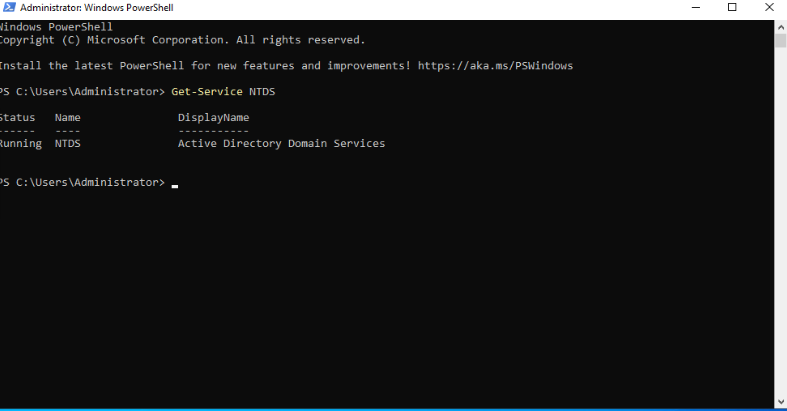
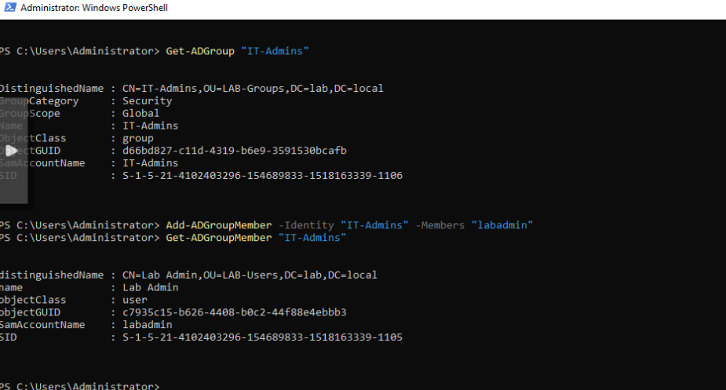

# Homelab-Portfolio
This repository documents my personal homelab environment and the hands-on projects I’ve built to develop practical IT systems administration and cybersecurity skills. The lab is designed to simulate real-world enterprise environments, allowing safe testing, troubleshooting, hardening, and documentation of systems.

## Lab Overview & Objectives

This homelab is designed to simulate a small-to-mid-sized enterprise IT environment, combining on-premises infrastructure, identity management, Linux services, and containerized workloads. The goal of the lab is to gain hands-on experience with real-world system administration tasks while following industry best practices for deployment, validation, and documentation.

Key objectives of this homelab include:
- Deploying and managing virtualized infrastructure using Proxmox VE
- Administering both Windows and Linux server operating systems
- Implementing centralized identity and access management with Active Directory
- Practicing role-based access control (RBAC) using users, groups, and OUs
- Deploying and validating containerized services using Docker
- Managing containers through Portainer for visibility and lifecycle control
- Verifying configurations using command-line tools and PowerShell
- Documenting each step to reflect real-world operational workflows

This lab emphasizes **installation, verification, and administration**, mirroring how systems are built, validated, and maintained in professional IT environments.

## Lab Screenshots

### Proxmox Host

*Primary Proxmox VE host used to manage virtual machines and containers.*
This system serves as the core virtualization platform for the homelab, providing centralized VM management, snapshots, and resource allocation.

### Windows Server Installation

*Microsoft Windows Server deployed as a virtual machine within the Proxmox environment.* 
This installation serves as a foundation for practicing Windows-based server administration, including role configuration, system updates, and enterprise service management.

## Active Directory Domain Services (AD DS)

### AD DS Installation

Active Directory Domain Services installed on Windows Server using PowerShell to enable centralized identity and access management.

---

### AD Service Verification

The NTDS service verified as running via PowerShell, confirming a successful AD DS installation.

---

### Domain Creation and Verification

Windows Server promoted to a domain controller and Active Directory domain created and validated using PowerShell.

---

### AD Object Management (Users, Groups, and OUs)

Organizational Units created to separate domain controllers and user accounts in a scalable structure.

Security groups created and managed using PowerShell, with users assigned to role-based groups to demonstrate RBAC.

### Ubuntu Server Deployment

*Ubuntu Server LTS virtual machine deployed for service hosting and administration.*
This VM is used for Linux server administration practice, service hosting, and command-line management.

### Ubuntu Static IP Configuration

*Static IP configuration applied to ensure consistent network access.*
This setup mirrors real-world server environments where predictable addressing is required for reliability and management.

### Docker Installation Verification

Docker installation verified using the official `hello-world` container, confirming successful client–daemon communication, image retrieval, and container execution.

### Portainer Deployment via Docker

Portainer CE deployed as a Docker container on Ubuntu Server to provide web-based container management with persistent storage and automatic restart configuration.

### Portainer Container Management

Portainer dashboard displaying the Docker environment, enabling centralized monitoring and management of containers, images, volumes, and networks.
