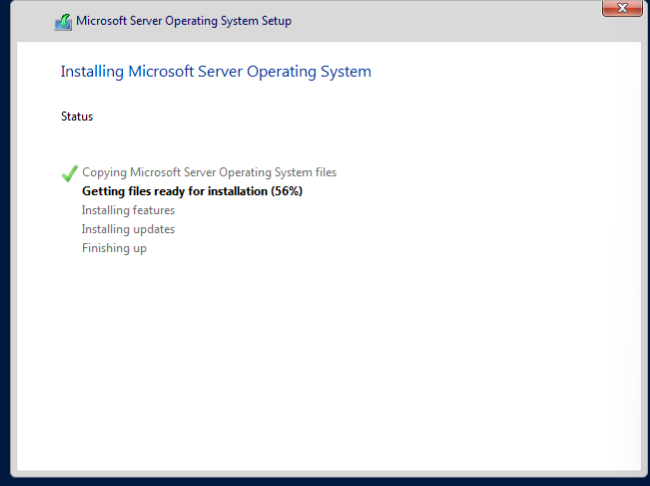
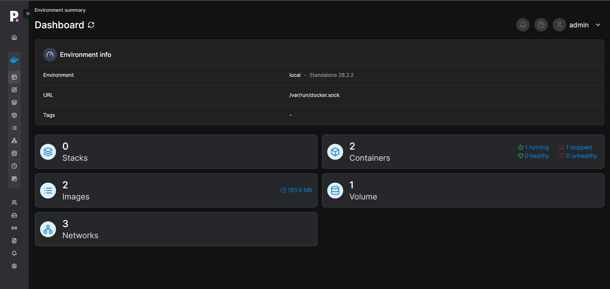

# Homelab-Portfolio
This repository documents my personal homelab environment and the hands-on projects I’ve built to develop practical IT systems administration and cybersecurity skills. The lab is designed to simulate real-world enterprise environments, allowing safe testing, troubleshooting, hardening, and documentation of systems.

## Lab Screenshots

### Proxmox Host

*Primary Proxmox VE host used to manage virtual machines and containers.*
This system serves as the core virtualization platform for the homelab, providing centralized VM management, snapshots, and resource allocation.

### Windows Server Installation

*Microsoft Windows Server deployed as a virtual machine within the Proxmox environment.* 
This installation serves as a foundation for practicing Windows-based server administration, including role configuration, system updates, and enterprise service management.

### Ubuntu Server Deployment

*Ubuntu Server LTS virtual machine deployed for service hosting and administration.*
This VM is used for Linux server administration practice, service hosting, and command-line management.

### Ubuntu Static IP Configuration

*Static IP configuration applied to ensure consistent network access.*
This setup mirrors real-world server environments where predictable addressing is required for reliability and management.

### Docker Installation Verification

*Docker installation validated using the official `hello-world` container.*
This test confirms successful communication between the Docker client and daemon, image retrieval from Docker Hub, container execution, and output streaming to the terminal.

### Portainer Deployment via Docker

*Portainer CE deployed as a Docker container on Ubuntu Server to manage and monitor containerized services.*
The installation includes persistent volumes, automatic restart configuration, and exposed management ports for secure web-based administration.

### Portainer Container Management

*Portainer CE dashboard displaying the Docker environment running on Ubuntu Server.*
This interface is used to manage containers, images, volumes, and networks, providing visibility into container status, health, and resource usage.
